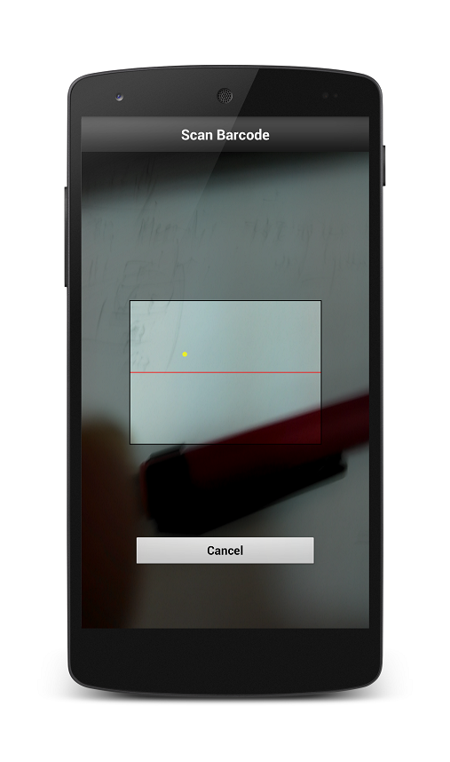

library
=======

Book library in Android.

Sliding menu for navigation
--------------
 

Personal page
--------------

Library page
--------------

Book detail page
--------------

Scanner page
--------------

